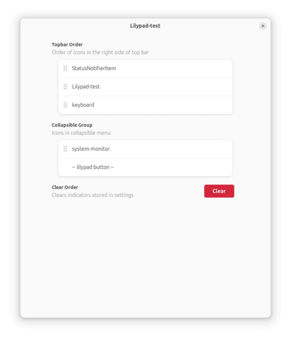

# Lilypad
Organize, hide, and reorder app indicators in GNOME top bar


Inspired by [Dozer for macOS](https://github.com/Mortennn/Dozer).

## Usage
- Left click Lilypad icon to toggle "grouped" icon visibility
- Right click Lilypad icon to open settings
    - drag and drop menu to reorder indicators
    - "Clear" button to reset order



## Development Goals
- [x] drag and drop to reorder
- [x] button to toggle visibility
- [x] support for non-GTK native apps *(eg. Discord, Slack)*
- [x] auto collapse timer
- [x] support for tablets and touchscreens
- [ ] permanently hide items
- [ ] input custom indicator alias
- [ ] support for more GNOME versions

## Requirements
Linux distribution running GNOME versions: 46, 47, 48:
```
Fedora 40, 41, 42
Ubuntu 24.04, 24.10, 25.04
...
```

## Installation

#### Method 1: GNOME Extension
Install the latest version directly from [GNOME Extensions](https://extensions.gnome.org/extension/7266/lilypad/).

---

#### Method 2: install from source
1. Clone and the zip the repository OR download the archive from:
```https://github.com/shendrew/Lilypad/archive/refs/heads/main.zip```

2. Rename the zip file to:
```lilypad@shendrew.github.io.zip```

3. Install with:
```gnome-extensions install -f lilypad@shendrew.github.io.zip```

4. Re-login

## Resources
Very useful links that helped me build this project:
- ["How to ..." series by Just Perfection](https://www.youtube.com/watch?v=iMyR5lJf7dU&list=PLr3kuDAFECjZhW-p56BoVB7SubdUHBVQT)
- [GNOME JavaScript Guide](https://gjs.guide/extensions/)
- [GJS API Docs](https://gjs-docs.gnome.org/)
- [Workbench](https://apps.gnome.org/Workbench/) (for UI testing)
